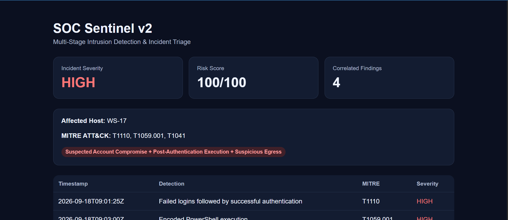

# SOC Sentinel v2

**Multi-Stage Intrusion Detection & Incident Triage Engine**

SOC Sentinel is a Python-based SOC investigation project that correlates authentication, endpoint/process, PowerShell, and network telemetry to identify multi-stage intrusion activity.

Instead of treating alerts independently, the engine links suspicious events by **host and time window**, maps activity to **MITRE ATT&CK**, assigns a risk score, extracts IOCs, and produces analyst-ready investigation artifacts.



---

## Overview

The project analyzes a simulated enterprise security dataset containing:

- 231 total security events
- 220 benign background events
- multiple users and endpoints
- normal authentication activity
- normal network traffic
- normal process execution
- benign failed-login activity
- one hidden multi-stage attack against `WS-17`

SOC Sentinel identifies the malicious sequence from the surrounding noise and correlates the individual detections into one high-severity incident.

---

## Attack Chain

```text
5 Failed Login Attempts
        ↓
Successful Authentication
        ↓
winword.exe → powershell.exe
        ↓
Encoded PowerShell Execution
        ↓
2.5 MB Outbound Transfer
        ↓
Threat-Listed External IP
        ↓
HIGH Severity Incident
